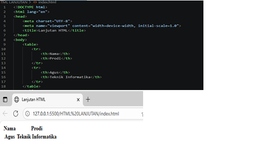
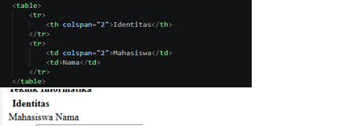
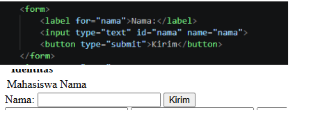
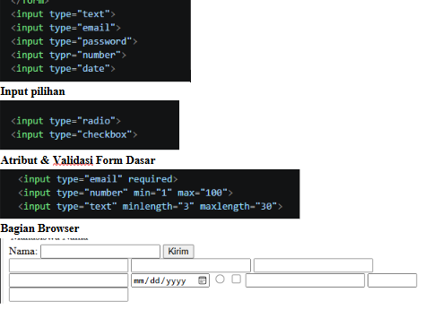
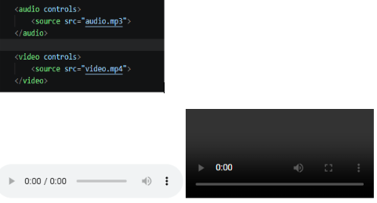
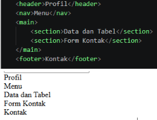
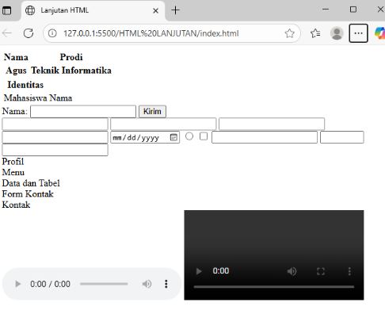

## TUGAS LANJUTAN HTML
 <b>Table, form, semantic HTML, multimedia, dan validasi form dasar.</b>

### 1.  Struktur Dasar HTML Table

### 2. Menggabungkan Sel: colspan & rowspan 

### 3.Struktur Dasar HTML Form

### 4. Jenis Input HTML

### 5. Audio, Video, dan Media 

### 6. Mini Project: Profil Mahasiswa 

### 7. Tampilan keseluruhan web
