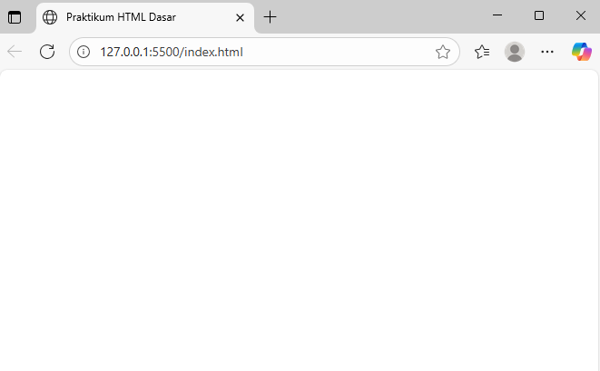
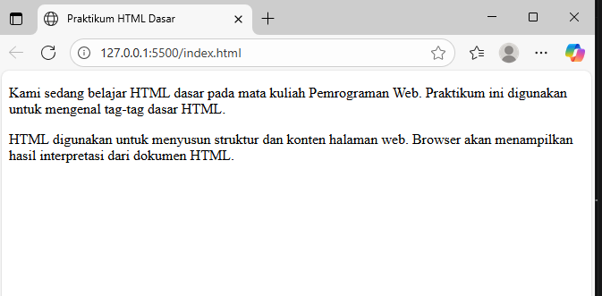
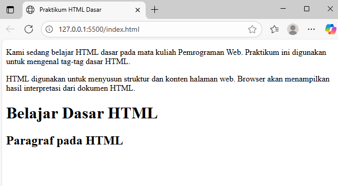
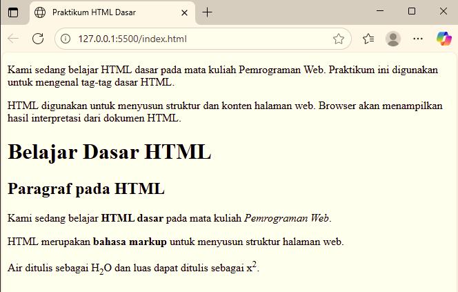
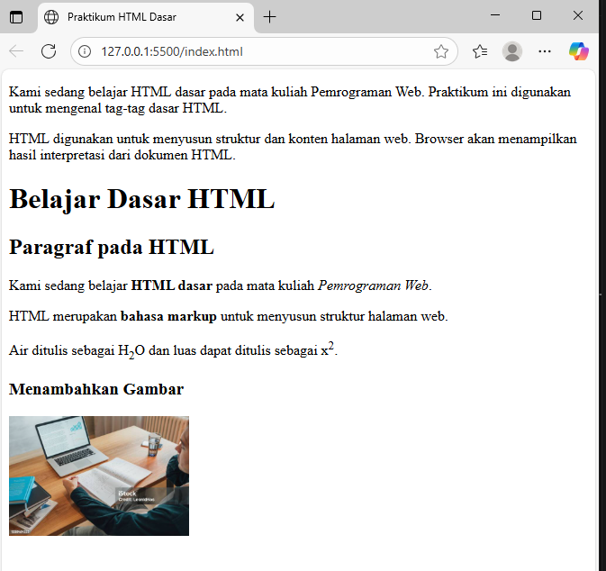
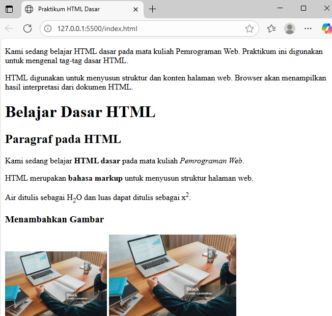
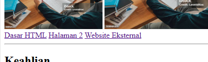
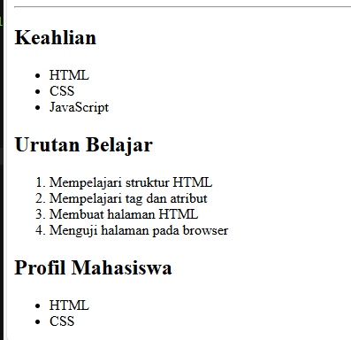
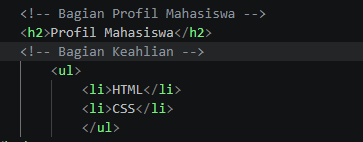

# Praktikum 1 (PEMROGRAMAN WEB)
## NAMA : AGUS SALEH RUMBOUW
## NIM  : 312510465
## KELAS: I251A
<b><I>Membuat HTML Dasar</i></b>

## Hasil Screnshot
1. Tampilan web

2. Tampilan Paragraf pada Browser

3. Menambahkan Judul

4. Memformat Teks

5. Menyisipkan Gambar

6. Mengatur Ukuran Gambar

7. Menambahkan Hyperlink

9. Menambahkan List

10. Komentar

